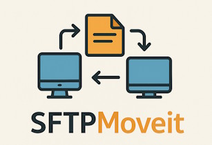

# SFTPMoveit



## 何するアプリ？

いろいろなプロトコルで、データをアップロードしたりダウンロードしたりするツールは、
多数あるのですが、機能を制限したシンプルなものを見つけることができなかったので、
なるべくシンプルにしたものです。  


### 出来ること
  
1. 指定したフォルダの中身を指定した先へアップロードする  
2. 指定したフォルダの中身を指定した先へダウンロードする  

の２つだけです。  


## 使い方

1. `bin`の中にある`sftpmoveit.zip`をダウンロードして、適当な場所に解凍します。  
この時、フォルダの中には、`sftpmoveit.exe`だけになるようにしておくと後で都合が良いです。  

2. `sftpmoveit.exe`を１度実行します。  
`config.json`と`transfer.log`が作成されます。  
`config.json`: 設定ファイル  
`transfer.log`: 動作ログ　


3. `config.json`に、設定を記述する。  

```
{
  "host": "sftp.example.com",
  "port": 22,
  "username": "your_username",
  "keyfile": "id_rsa",
  "password": "",
  "direction": "upload",
  "local": "C:/YourLocalFolder/",
  "remote": "/remote/folder/path/"
}
```

|項目|コメント|
|-|-|
|host|接続先のホスト名やIPアドレスを記述します|
|port|ポート番号。特に指定がない限り、このままで大丈夫。|
|username|ログインユーザー名|
|keyfile|鍵認証を使用する場合は、秘密鍵のパスを記述(OpenSSL形式のみ、パスフレーズ無しのみ)|
|password|パスワード認証用のパスワードを記述|
|direction|`upload` または、`download`を指定|
|local|ローカル側のフォルダのパス|
|remote|リモート側のフォルダのパス|
  
  
4. タスクマネージャーに、`sftpmoveit.exe`を登録して、定期実行させる。  


## コンパイル方法

```
python -m nuitka --onefile --output-dir=build_dir sftpmoveit.py
```


## ライセンス
MIT ライセンスです。
需要があれば、自己責任でどうぞ。